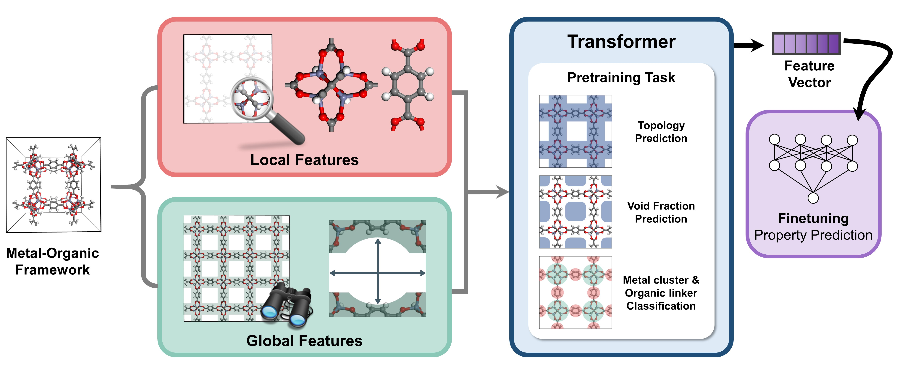

MOFTransformer
===============

MOFTransformer is a python library for transfer learning of metal-organic frameworks (MOFs).
it provides tools for fine-tuning, pre-training, feature importance analysis with MOFTransformer.

Features
--------
- we provide `a ckpt file <https://figshare.com/articles/dataset/MOFTransformer/21155506>`_ of MOFTransformer pre-trained with 1 million hypothetical MOFs.
- By fine-tuning the pretraining model, it ensures high-performance of transfer learning across various properties.
- we provide `the pre-calculated atom-based embeddings and energy-grid embedding <https://figshare.com/articles/dataset/MOFTransformer/21155506>`_ for CoRE MOF, QMOF database.
- You can easily visualize feature importance analysis from attention scores of the fine-tuning models.

**atom-base graph embedding**

.. image:: getting_started/assets/1.gif
   :width: 800

**energy-grid embedding**

.. image:: getting_started/assets/6.gif
   :width: 800

**patches of energy-grid embedding**

.. image:: getting_started/assets/7.gif
   :width: 800

.. image:: getting_started/assets/8.gif
   :width: 800

Contents
--------
.. toctree::
   :titlesonly:
   :maxdepth: 2

   introduction
   installation
   dataset
   getting_started
   tutorial

Indices and Tables
------------------
* :ref:`genindex`
* :ref:`modindex`
* :ref:`search`

