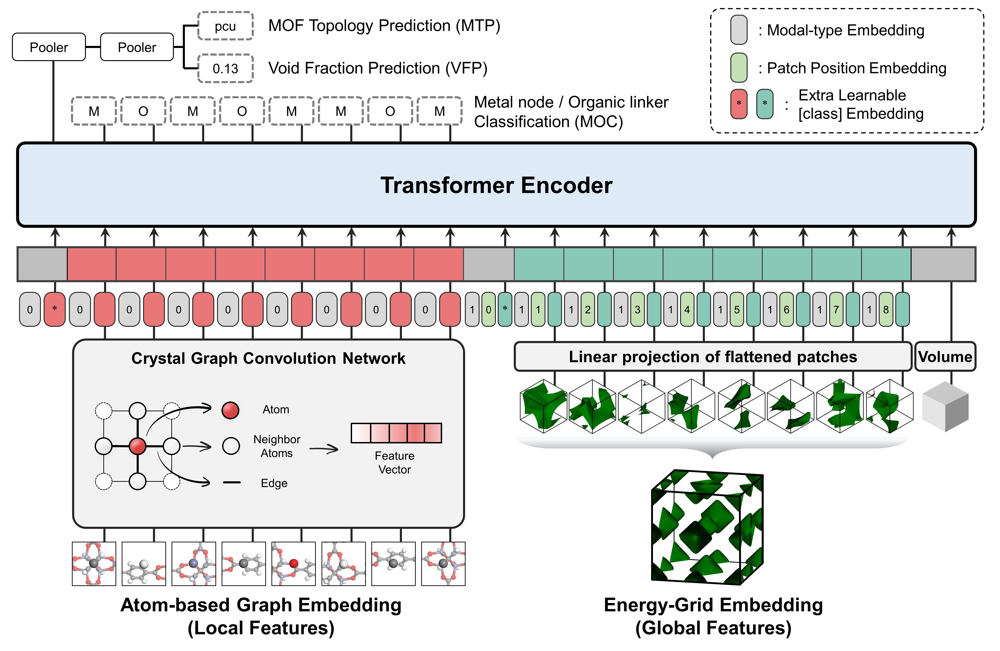

.. MOFTransformer documentation master file, created by
   sphinx-quickstart on Mon Sep 12 11:15:48 2022.
   You can adapt this file completely to your liking, but it should at least
   contain the root `toctree` directive.

MOFTransformer
===============

MOFTransformer is a multi-modal pretrained Transformer encoder which is designed to effectively capture both
local features and global features for Metal-Organic Frameworks (MOFs).
* local features: chemistry of the building blocks (e.g., metal nodes, organic linkers, functional groups, etc)
* global features: geometric and topological descriptors (e.g., topology, pore volume, surface area, etc.)

We provided the pretrained model pretrained with 1M hypothetical Metal-Organic Frameworks (MOFs).
The pretraining tasks are as belows:

1. **MTP** (MOF Topology Prediction)
2. **MOC** (Metal node/Organic linker Classification)
3. **VFP** (accessible Void Fraction Prediction)

.. image:: assets/fig1.jpg
   :width: 800

Architecture
------------
MOFTransformer takes atom-wise graph embeddings and energy-grid embeddings that include information regarding
local features and global features, respectively.

Contents
--------
.. toctree::
   :maxdepth: 2

   installation
   dataset
   training

Indices and Tables
------------------
* :ref:`genindex`
* :ref:`modindex`
* :ref:`search`

