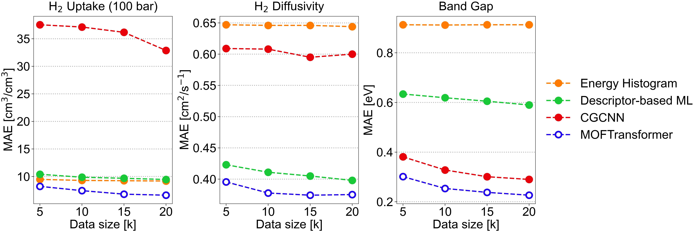

# Introduction

`MOFTransformer` is a multi-modal Transformer pre-trained with 1 million hypothetical metal-organic frameworks (MOFs). 
By fine-tuning, it ensures high performance of transfer learning across various properties of MOFs that include gas uptake, diffusivity, and electronic properties. 

## Pre-training

- `MOFTransformer` takes two disparate types of embeddings:
  - Atom-based Graph Embedding : CGCNN w/o pooling layer 
  - Energy-grid Embedding : 1D flatten patches of 3D energy grid
  

- An objective of pre-training is to efficiently capture both local and global features.
  - local features : metal node, organic linker, functional groups, etc.
  - global features : topology, pore volume, surface area, etc.

- The pre-training tasks are as belows:
  - MTP (MOF Topology Prediction)
  - MOC (Metal node/Organic linker Classification)
  - VFP (accessible Void Fraction Prediction)

## Fine-tuning
- In the fine-tuning step, `MOFTransformer` is traind to predict the desired properties with the weights of the pre-trained model as initial weights.
- A single dense layer is added to [CLS] token for fine-tuning

### Results
Gas uptake (H2 uptake at 100 bar), Diffusivity (H2 diffusivity), Electronic properties (PBE bandgap)

### reference
1. [Energy Histogram](https://pubs.rsc.org/en/content/articlelanding/2019/me/c8me00050f)
2. [Descriptor-based ML model](https://pubs.acs.org/doi/abs/10.1021/acsami.1c18521)
3. [Crystal Graph Convolutional Neural Networks (CGCNN)](https://journals.aps.org/prl/abstract/10.1103/PhysRevLett.120.145301)

## Universal transfer learning
| Property                                 | MOFTransformer | Original Paper | Number of Data | Remarks          | Reference |
|------------------------------------------|----------------|----------------|----------------|------------------|-----------|
|N2 uptake                     | R2: 0.78       | R2: 0.71       | 5,286          | CoRE MOF         | 1         |
|O2 uptake                     | R2: 0.83       | R2: 0.74       | 5,286          | CoRE MOF         | 1         |
|N2 diffusivity                | R2: 0.77       | R2: 0.76       | 5,286          | CoRE MOF         | 1         |
|O2 diffusivity                | R2: 0.78       | R2: 0.74       | 5,286          | CoRE MOF         | 1         |
|CO2 Henry coefficient         | MAE : 0.30     | MAE : 0.42     | 8,183          | CoRE MOF         | 2         |
|Solvent removal stability classification | ACC : 0.76     | ACC : 0.76     | 2,148          | Text-mining data | 3         |
|Thermal stability regression             | R2 : 0.44      | R2 : 0.46      | 3,098          | Text-mining data | 3         |
### reference
1. [Prediction of O2/N2 Selectivity in Metal−Organic Frameworks via High-Throughput Computational Screening and Machine Learning](https://pubs.acs.org/doi/abs/10.1021/acsami.1c18521)
2. [Understanding the diversity of the metal-organic framework ecosystem](https://www.nature.com/articles/s41467-020-17755-8)
3. [Using Machine Learning and Data Mining to Leverage Community Knowledge for the Engineering of Stable Metal–Organic Frameworks](https://pubs.acs.org/doi/full/10.1021/jacs.1c07217)